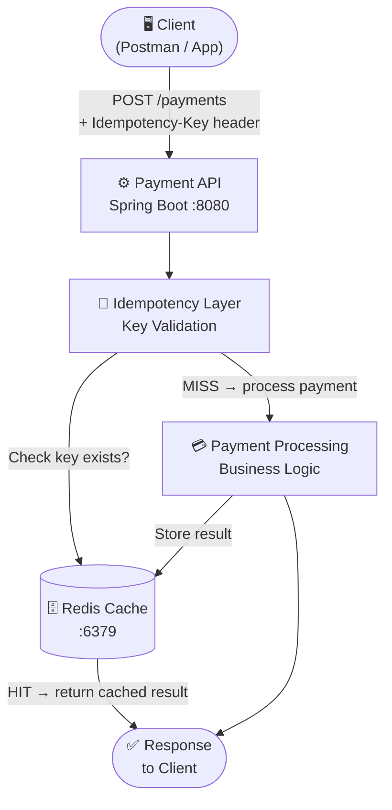
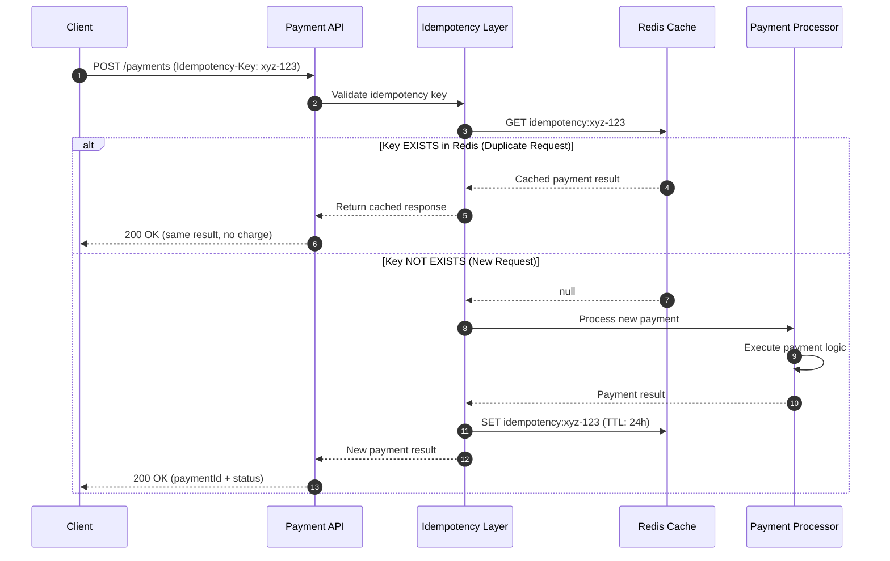
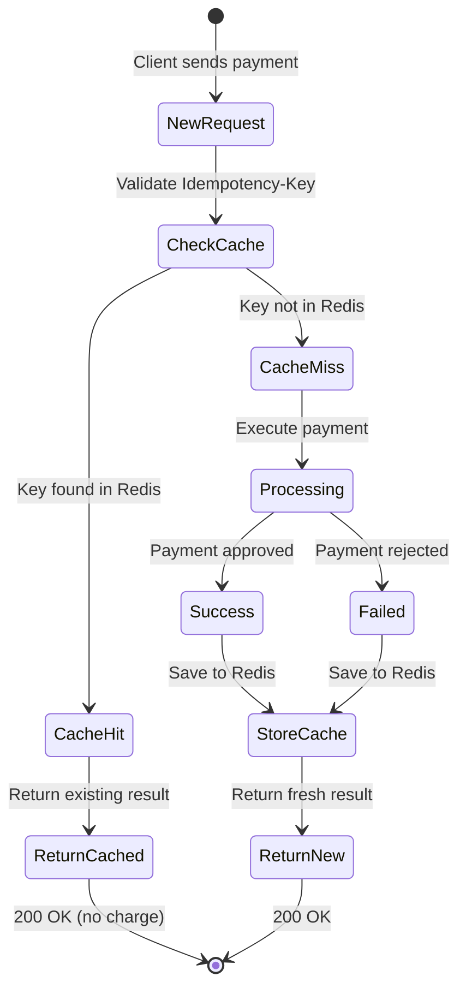

# 💳 Mini Payment Gateway

> A production-inspired payment gateway built with **Java 17**, **Spring Boot**, **Redis**, and **Docker** — demonstrating idempotency, distributed caching, and scalable microservice architecture.


---

## 📖 Overview

This project simulates how modern payment platforms like Razorpay and Stripe process payments safely at scale. It focuses on three critical backend engineering concepts:

- **Idempotency** — preventing duplicate charges on retried requests
- **Distributed Caching** — Redis-backed state management for fast lookups
- **Retry-Safe Architecture** — ensuring no double-billing under network failures

---

## ✨ Features

| Feature | Description |
|---|---|
| 💰 Payment Processing API | RESTful endpoint to initiate payments |
| 🔑 Idempotency Handling | Duplicate request detection via idempotency keys |
| ⚡ Redis Caching | Distributed cache for payment state |
| 🔁 Retry-Safe Transactions | Safe to retry without double charges |
| 🐳 Docker Support | Fully containerized for easy deployment |
| 📦 Scalable Architecture | Microservice-style, horizontally scalable |

---

## 🏗️ System Architecture



---

## 🔄 Payment Flow — Sequence Diagram



---

## 🛠️ Tech Stack

### Backend
- **Java 17** — Core language
- **Spring Boot** — REST API framework
- **Gradle** — Build tool

### Infrastructure
- **Redis** — Distributed cache & idempotency store
- **Docker** — Containerization
- **Docker Compose** — Multi-container orchestration

### Developer Tools
- **Postman** — API testing
- **GitHub** — Version control

---

## 📦 Project Structure

```
mini-payment-gateway/
├── src/
│   └── main/
│       ├── java/
│       │   └── com/gateway/
│       │       ├── controller/       # REST controllers
│       │       ├── service/          # Business logic
│       │       ├── model/            # Request/Response models
│       │       └── cache/            # Redis idempotency logic
│       └── resources/
│           └── application.yml       # App configuration
├── Dockerfile
├── docker-compose.yml
├── build.gradle
└── README.md
```

---

## 🚀 Getting Started

### Prerequisites

- Java 17+
- Docker
- Gradle

### 1. Clone the Repository

```bash
git clone https://github.com/your-username/mini-payment-gateway.git
cd mini-payment-gateway
```

### 2. Start Redis

```bash
docker run -d -p 6379:6379 --name redis redis
```

### 3. Run the Application

```bash
./gradlew bootRun
```

Or build and run the JAR:

```bash
./gradlew build
java -jar build/libs/*.jar
```

The server starts at **http://localhost:8080**

---

## 🐳 Docker Deployment

### Build & Run with Docker

```bash
# Build image
docker build -t mini-payment-gateway .

# Run container
docker run -p 8080:8080 mini-payment-gateway
```

### Run with Docker Compose (Recommended)

```bash
docker-compose up --build
```

---

## 📡 API Reference

### POST `/payments` — Create Payment

**Headers**

```
Content-Type: application/json
Idempotency-Key: <unique-uuid>
```

**Request Body**

```json
{
  "amount": 1000,
  "currency": "INR",
  "userId": "12345"
}
```

**Response — 200 OK**

```json
{
  "paymentId": "pay_123456",
  "status": "SUCCESS"
}
```

**cURL Example**

```bash
curl -X POST http://localhost:8080/payments \
  -H "Content-Type: application/json" \
  -H "Idempotency-Key: test-key-001" \
  -d '{"amount": 1000, "currency": "INR", "userId": "12345"}'
```

---

## 🔑 Key Concepts

### Idempotency
When a client retries a request (due to network timeout), the same `Idempotency-Key` is sent. The server checks Redis — if the key already exists, it returns the **cached result without re-processing**, preventing double charges.

### Redis Caching
All idempotency keys and their results are stored in Redis with a TTL (e.g., 24 hours). This provides O(1) lookup performance and works across multiple service instances.

### Retry-Safe Design
```
First Request  → Process → Store in Redis → Return result
Retry Request  → Check Redis (HIT) → Return same result (no re-processing)
```

---

## 🗺️ Idempotency State Machine



---

## 🔮 Future Improvements

- [ ] Database persistence (PostgreSQL)
- [ ] Webhook notifications for payment events
- [ ] Payment status tracking endpoint (`GET /payments/{id}`)
- [ ] Message queue integration (Kafka / RabbitMQ)
- [ ] Authentication & Authorization (JWT)
- [ ] Rate limiting per user/IP
- [ ] Payment analytics dashboard

---

## 🎓 Learning Goals

This project is a practical demonstration of:

- ✅ Backend system design for financial systems
- ✅ Idempotent API design patterns
- ✅ Distributed caching with Redis
- ✅ Payment processing flow fundamentals
- ✅ Docker-based deployment
- ✅ Microservice architecture concepts

---

## 👨‍💻 Author

**Harsh Thaker** — Backend Developer

[](https://github.com/your-username)

---

> ⭐ If this project helped you understand payment systems, consider giving it a star!
